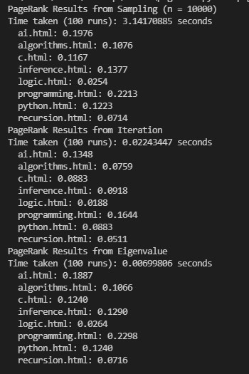

# PageRank

3 different approaches to getting a page rank for a given website based on their hyperlinks

## Sampling (Random Surfer Model)

The random surfer model imagines a surfer who starts with a web page at random, and then randomly chooses links to follow.

A page’s PageRank, then, can be described as the probability that a random surfer is on that page at any given time. After all, if there are more links to a particular page, then it’s more likely that a random surfer will end up on that page. Moreover, a link from a more important site is more likely to be clicked on than a link from a less important site that fewer pages link to, so this model handles weighting links by their importance as well.

By sampling states randomly from the Markov Chain, we can get an estimate for each page’s PageRank. We can start by choosing a page at random, then keep following links at random, keeping track of how many times we’ve visited each page. After we’ve gathered all of our samples (based on a number we choose in advance), the proportion of the time we were on each page might be an estimate for that page’s rank.

## Iterative

We can also define a page’s PageRank using a recursive mathematical expression. Let PR(p) be the PageRank of a given page p: the probability that a random surfer ends up on that page. How do we define PR(p)? Well, we know there are two ways that a random surfer could end up on the page:

With probability 1 - d, the surfer chose a page at random and ended up on page p.
With probability d, the surfer followed a link from a page i to page p.
The first condition is fairly straightforward to express mathematically: it’s 1 - d divided by N, where N is the total number of pages across the entire corpus. This is because the 1 - d probability of choosing a page at random is split evenly among all N possible pages.

For the second condition, we need to consider each possible page i that links to page p. For each of those incoming pages, let NumLinks(i) be the number of links on page i. Each page i that links to p has its own PageRank, PR(i), representing the probability that we are on page i at any given time. And since from page i we travel to any of that page’s links with equal probability, we divide PR(i) by the number of links NumLinks(i) to get the probability that we were on page i and chose the link to page p.

This gives us the following definition for the PageRank for a page p.

PR(p) = (1 - d)/N + d * (sum(PR(i)/NumLinks(i)))

In this formula, d is the damping factor, N is the total number of pages in the corpus, i ranges over all pages that link to page p, and NumLinks(i) is the number of links present on page i.

## Eigenvectors

Built on the random surfer algorithm. We first define a transition matrix which is a matrix which comprises of all the probabilities of landing up on every other page from a given page, A.

For example, if there are 4 links in total, the initial probability, v, could be [0.25, 0.25, 0.25, 0.25], and A could be a 4x4 transition matrix. Hence, Av would represent the new probability distribution of the links after 1 iteration. and A^2v for 2 iterations etc.

However, we can observe that raising A to an infinite power, n, times v would be the same as A^(n + 1)v since there is nothing larger than infinite. Hence, by factorising both sides, we can observe that there would be a given u where Au = u, and u turns out to be the terminal probability distribution for page ranks, which could be easily solved using eigen vectors. 

## Results

## References
* http://pi.math.cornell.edu/~mec/Winter2009/RalucaRemus/Lecture3/lecture3.html
* https://math.stackexchange.com/questions/936757/why-is-pagerank-an-eigenvector-problem